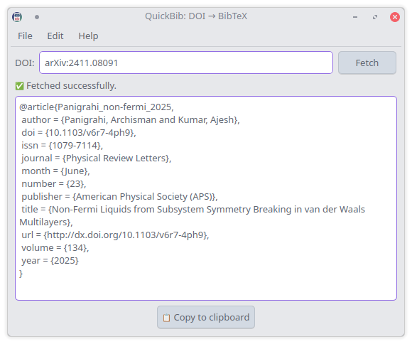

#   <br> QuickBib

This is a cross platform app that enables you to get the bibtex entry from a DOI number. It uses [doi2bib3](https://github.com/archisman-panigrahi/doi2bib3) as its backend. Written in Python, QuickBib is licensed under GPLv3.
 


## How to install?

### GNU/Linux
<a href="https://repology.org/project/quickbib/versions">
    
</a>

 - On Arch Linux, you can get it from the AUR

```
yay -S quickbib
```

- On Ubuntu (24.04+), you can use our [official PPA](https://code.launchpad.net/~apandada1/+archive/ubuntu/quickbib)
```
sudo add-apt-repository ppa:apandada1/quickbib
sudo apt update
sudo apt install quickbib
```

- Other distros: Install from source
Install the required dependencies, pyqt6 and [doi2bib3](https://github.com/archisman-panigrahi/doi2bib3). Afterwards, you can use meson to install quickbib.
```
meson setup builddir --prefix="$HOME/.local"
meson install -C builddir
```

To uninstall, 
```
meson uninstall -C builddir
```

### Windows
Prebuilt installers are available to download in [GitHub Releases](https://github.com/archisman-panigrahi/QuickBib/releases/latest).

### macOS

You can install the app's dependencies with pip and run from source (**see below**). On macOS there are a few platform-specific caveats (Qt and PyQt6 install paths, notarization when packaging, etc.), so the short instructions below focus on running QuickBib from source for development/testing. **If you have a better idea about how to package the macOS app in a more convenient way (without perpetually paying Apple), please let us know in GitHub Issues**.


## How to run from source?

1. Clone the repo and enter it

```
git clone https://github.com/archisman-panigrahi/quickbib.git
cd quickbib
```

2. Create and activate a virtual environment (recommended)

```
python3 -m venv .venv
source .venv/bin/activate
```

3. Upgrade pip and install dependencies

```
python -m pip install --upgrade pip
pip install -r requirements.txt
```

4. Run QuickBib from source

You can run the package module directly:

```
python3 -m quickbib
```

Or run the convenience script in `bin/quickbib`:

```
./bin/quickbib
```

First, clone this repo.

```
git clone https://github.com/archisman-panigrahi/quickbib.git
cd quickbib
```

Then, run it with

```
python3 -m quickbib
```
